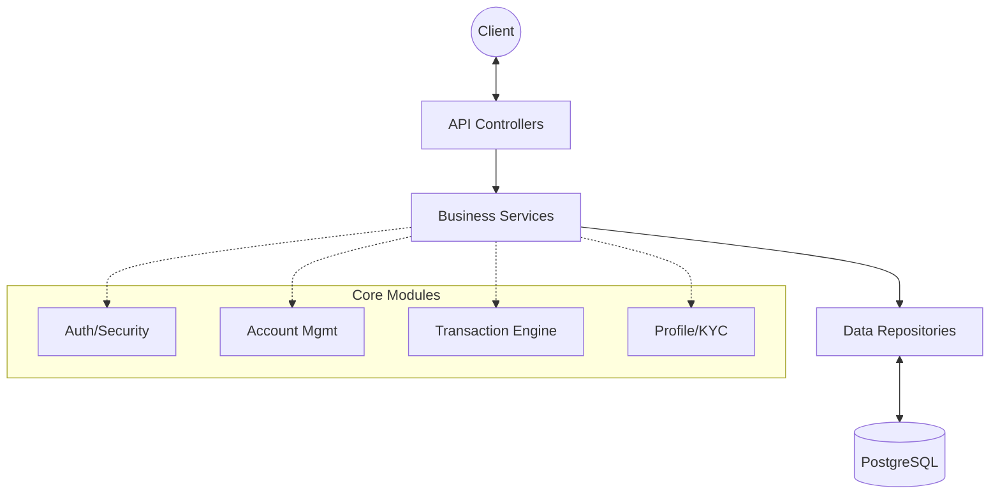
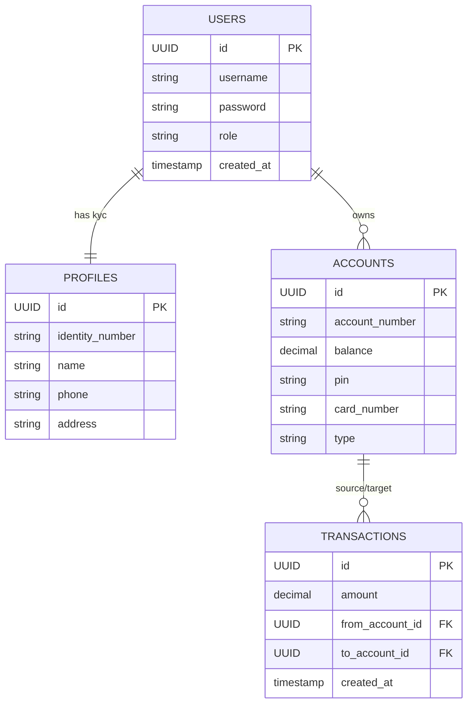
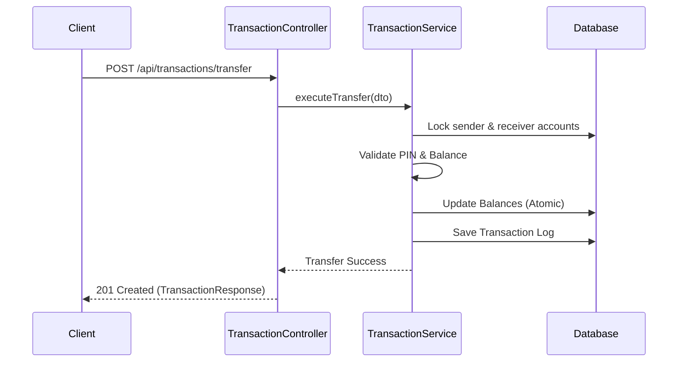

<h1 align="center">Core Bank System API</h1>

<p align="center">
  <strong>A high-performance, secure, and robust banking backend built with Java 25 and Spring Boot 4.0.1.</strong>
</p>

<p align="center">
  
  
  
  
  
</p>

---

## Overview

**Core Bank System** is a mission-critical RESTful API designed to handle modern banking operations with precision and security. From multi-role user management to atomic transaction processing, this system provides a solid foundation for financial service applications.

### Key Features

| Feature | Description |
| :--- | :--- |
| **Secure Auth** | JWT-based authentication with role-based access control (Admin/User). |
| **Account Mgmt** | Dynamic account generation with unique Account Numbers, PINs, and CVVs. |
| **Transactions** | Atomic transfers, deposits, and withdrawals with balance integrity. |
| **Profile Engine** | Comprehensive user profiles (KYC ready) with full identification tracking. |
| **Audit Trail** | Automated `createdAt` and `updatedAt` tracking using JPA Auditing. |
| **DB Evolution** | Version-controlled schema migrations using Flyway. |

---

## System Architecture

The project follows a **Package-by-Feature** architecture, promoting high cohesion and modularity.

### Core Components



### Database Schema (ERD)



---

## Getting Started

### Prerequisites

- **JDK 25** or higher
- **Docker & Docker Compose**
- **Maven** (or use `./mvnw`)

### Setup & Installation

1. **Clone & Environment**:
   ```bash
   git clone https://github.com/Karungg/core_bank_system.git
   cd core_bank_system
   cp .env.example .env # Configure your DB credentials
   ```

2. **Infrastructure**:
   ```bash
   docker compose up -d
   ```

3. **Run Application**:
   ```bash
   ./mvnw spring-boot:run
   ```

---

## Development Workflow

Professional tools integrated for quality and performance:

- **Testing**: Run comprehensive unit and integration tests (using Testcontainers).
  ```bash
  ./mvnw clean test
  ```
- **Performance**: Execute K6 load tests located in `k6/`.
  ```bash
  k6 run k6/script.js
  ```
- **Postman**: Import `postman/generic_collection.json` for manual exploration.

---

## API Reference & Samples

### Transaction Flow (Sequence)



### Sample Response: Account Details
`GET /api/accounts/{id}`
```json
{
  "id": "550e8400-e29b-41d4-a716-446655440000",
  "accountNumber": "1234567890",
  "balance": 2500000.50,
  "cardNumber": "4532XXXXXXXX1234",
  "type": "SAVINGS",
  "createdAt": "2024-04-04"
}
```

---

## License

Distributed under the MIT License. See `LICENSE` for more information.

<p align="center">
  Made by <strong>Miftah</strong>
</p>

